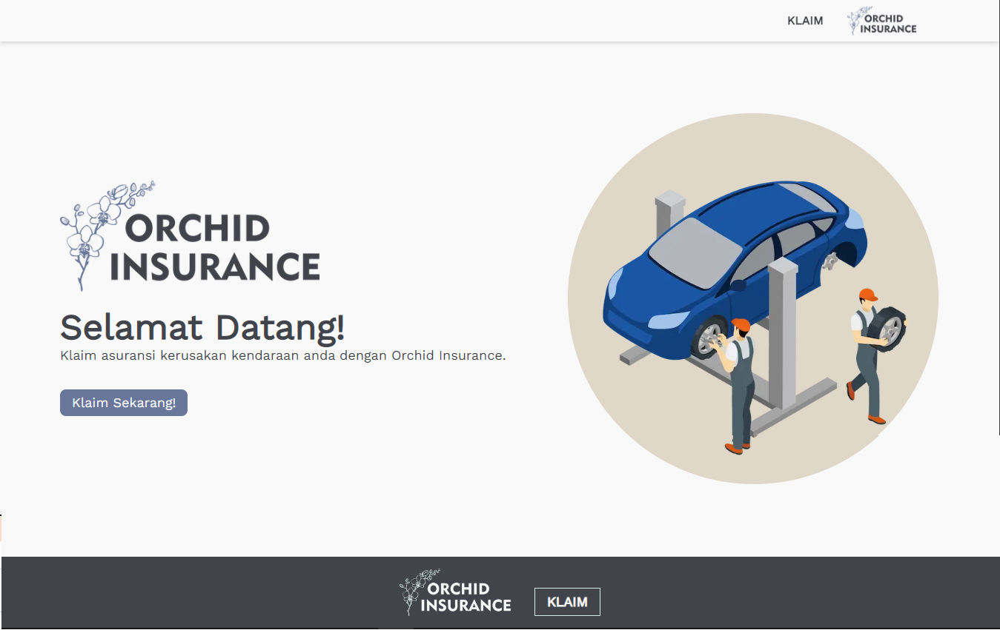
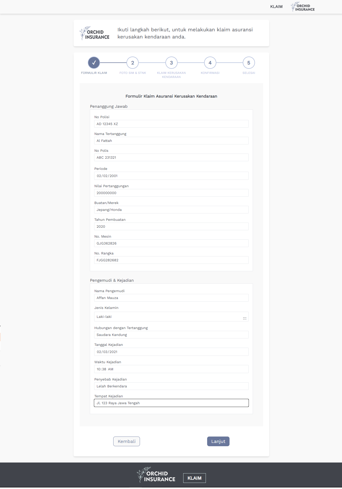
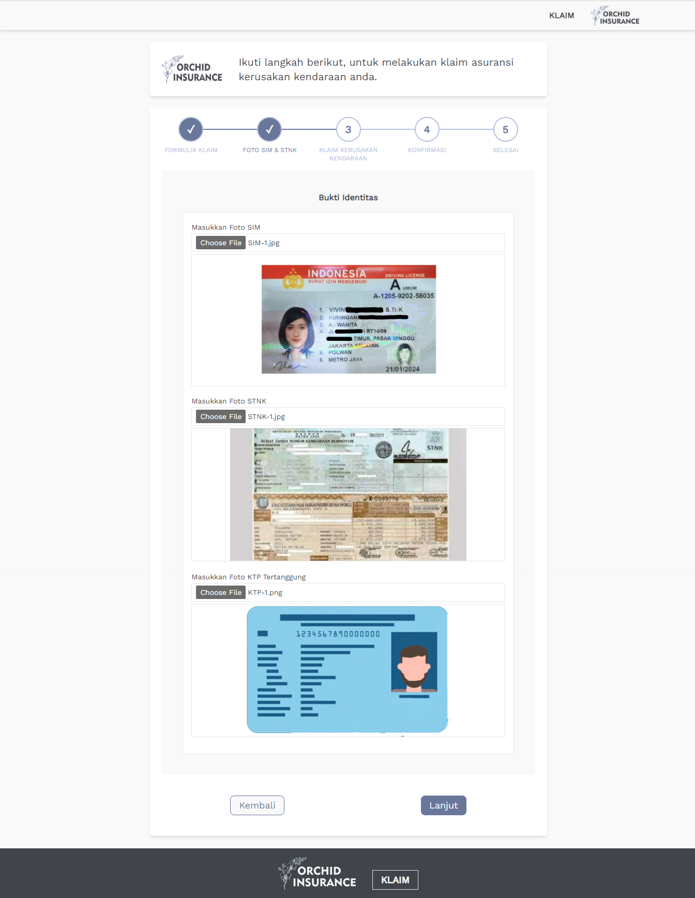
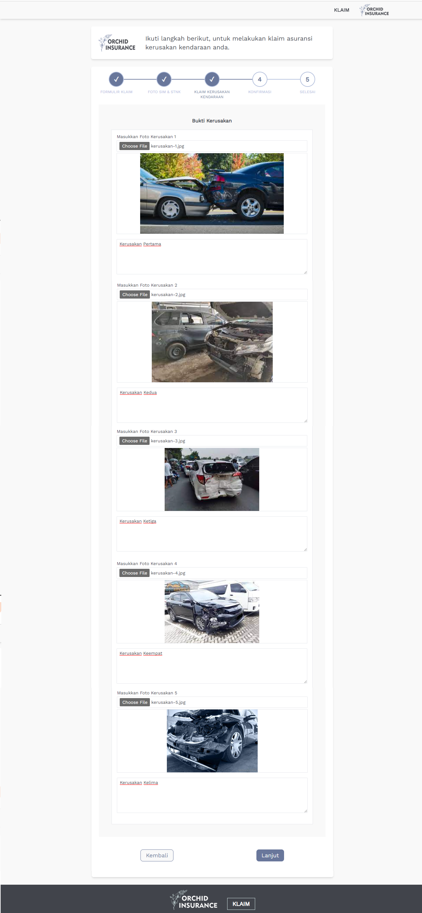
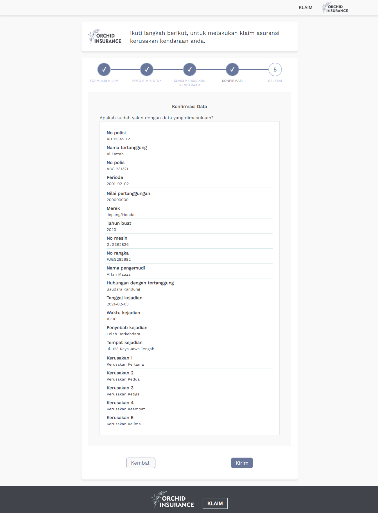
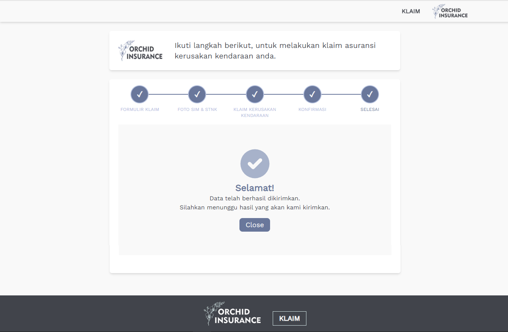

<div align="center">
    <br>
        
</div>

# Orchid Insurance

<strong>This project is a web application for for vehicle damage insurance claims. This Project built using Next JS and another tools.</strong>

</div>
<br>

## See Feature and UI Design of this project:

<details><summary>Click Me!</summary>

- Home Page <br>
  This page will display the main page for insurance claims

  

- Klaim Page - Step 1<br>
  Claim page to fill out the registration form.

  

- Klaim Page - Step 2<br>
  Claim page to fill in photo proof of identity..

  

- Klaim Page - Step 3<br>
  Claims page to fill out photos of evidence of damage to the vehicle.

  

- Klaim Page - Step 4<br>
  Claim page for data confirmation..

  

- Klaim Page - Step 5<br>
  Claim page for data confirmation has been sent successfully.

  

</details>

## Language and Tools

<div>
    <a href="https://nextjs.org/">
    
    </a>&nbsp;
    <a href="https://www.javascript.com/">
    
    </a>&nbsp;
    <a href="https://www.w3schools.com/html/">
    </a>&nbsp;
    <a href="https://tailwindcss.com/">
    </a>&nbsp;
    <a href="https://headlessui.com/">
    </a>&nbsp;
    <a href="https://code.visualstudio.com/">
    </a>&nbsp;
    <a href="https://www.coreldraw.com/en/">
    <a href="https://vercel.com/">
    </a>&nbsp;
</div>
<br>
<br>

## Deployment

This project deployed in Vercel: https://orchid-insurance.vercel.app/
<br>
<br>

This is a [Next.js](https://nextjs.org/) project bootstrapped with [`create-next-app`](https://github.com/vercel/next.js/tree/canary/packages/create-next-app).

## Getting Started

First, run the development server:

```bash
npm run dev
# or
yarn dev
```

Open [http://localhost:3000](http://localhost:3000) with your browser to see the result.

You can start editing the page by modifying `pages/index.js`. The page auto-updates as you edit the file.

[API routes](https://nextjs.org/docs/api-routes/introduction) can be accessed on [http://localhost:3000/api/hello](http://localhost:3000/api/hello). This endpoint can be edited in `pages/api/hello.js`.

The `pages/api` directory is mapped to `/api/*`. Files in this directory are treated as [API routes](https://nextjs.org/docs/api-routes/introduction) instead of React pages.

## Learn More

To learn more about Next.js, take a look at the following resources:

- [Next.js Documentation](https://nextjs.org/docs) - learn about Next.js features and API.
- [Learn Next.js](https://nextjs.org/learn) - an interactive Next.js tutorial.

You can check out [the Next.js GitHub repository](https://github.com/vercel/next.js/) - your feedback and contributions are welcome!
